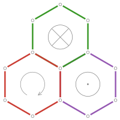
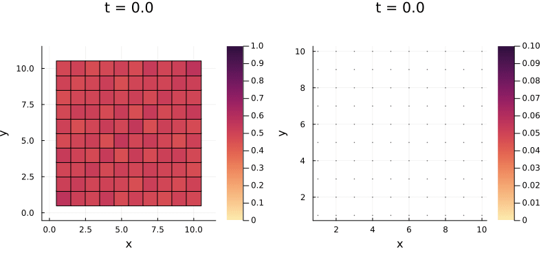

<p align="center"></p>

# LatticeModels.jl
[](https://aryavorskiy.github.io/LatticeModels.jl/)
[](https://codecov.io/gh/aryavorskiy/LatticeModels.jl)

This package provides a set of tools to simulate different quantum lattice systems.

WARNING: This package is currently in non-stable stage. The [v0.20](https://github.com/aryavorskiy/LatticeModels.jl/releases/tag/v0.20.0) release introduces lots of breaking changes, which can be seen in [CHANGES.md](CHANGES.md).

## Installation

Paste the following line into the Julia REPL:
```
]add https://github.com/aryavorskiy/LatticeModels.jl
```
or
```julia
import Pkg; Pkg.add(url="https://github.com/aryavorskiy/LatticeModels.jl")
```

## Sample workflow

```julia
using LatticeModels, Plots

# First create a lattice
l = SquareLattice(10, 10)

# Define a tight-binding model hamiltonian with a point flux field through point (5.5, 5.5)
h(B) = tightbinding_hamiltonian(l, field=PointFlux(B, (5.5, 5.5)))

# Find density matrix for filled bands (e. g. with energy < 0)
P_0 = densitymatrix(h(0))

# Perform unitary evolution
τ = 10
a = Animation()
@evolution {
    # Turn on the magnetic field adiabatically
    H := h(0.1 * min(t, τ) / τ)
    P_0 --> H --> P
} for t in 0:0.1:2τ
    # Find the local density and plot it
    plot(lattice_density(P), clims=(0,1))

    # Show currents on the plot
    plot!(DensityCurrents(H, P), arrows_scale=7)

    # Some more tweaks to the plot...
    title!("t = $t")
    frame(a)
end

gif(a, "animation.gif")
```

This code creates an animation which displays local density and currents on a heatmap:

