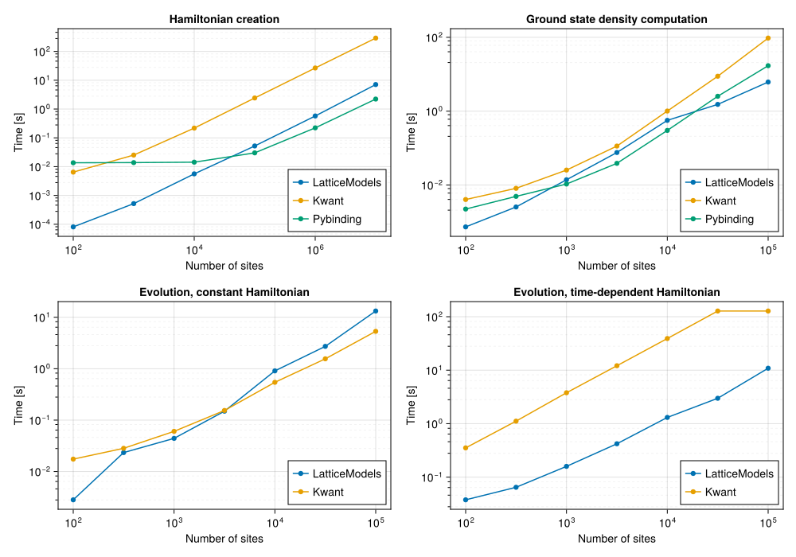

<p align="center"></p>

# LatticeModels.jl
[](https://aryavorskiy.github.io/LatticeModels.jl/dev)
[](https://codecov.io/gh/aryavorskiy/LatticeModels.jl)

This package provides a set of tools to simulate different quantum lattice systems.

## Installation

Paste the following line into the Julia REPL:
```
]add LatticeModels
```
or
```julia
import Pkg; Pkg.add(url="LatticeModels")
```

## Example

```julia
using LatticeModels, Plots

# First create a lattice
l = SquareLattice(10, 10)

# Define a tight-binding model hamiltonian with a point flux field through point (5.5, 5.5)
h(B) = tightbinding_hamiltonian(l, field=PointFlux(B, (5.5, 5.5)))

# Find density matrix for filled bands (e. g. with energy < 0)
P_0 = densitymatrix(h(0), mu = 0)

# Perform unitary evolution
τ = 10
a = Animation()
ev = Evolution(t -> h(0.2 * min(t, τ) / τ), P_0)
anim = @animate for state in ev(0:0.1:2τ)
    P, H, t = state
    p = plot(layout=2, size=(800, 400))
    # Find the local density and plot it
    plot!(p[1], localdensity(P), clims=(0, 1), st=:shape, c=:matter)

    # Show currents on the plot
    plot!(p[2], DensityCurrents(H, P), clims=(0, 0.1))

    # Some more tweaks to the plot...
    plot!(plottitle="t = $t")
end

gif(anim, "animation.gif")
```

This code creates an animation which displays local density and currents on a plot:


## Similar packages

Packages such as [Quantica.jl](https://github.com/pablosanjose/Quantica.jl), [pybinding](https://docs.pybinding.site/en/stable/index.html) and [Kwant](https://kwant-project.org/) provide similar functionality. And while they are all great packages, pybinding and Quantica are mostly focused on static properties of lattices. Kwant is more versatile, but its main focus is on quantum transport problems — it provides dynamic simulations in the `Tkwant` package, but `LatticeModels.jl` allows usage of various powerful backends, which improves performance and flexibility.

Here are some benchmarks: 



One can see dramatic performance improvements on small lattice sizes, while being competitive on larger ones.
These benchmarks were run on a regular JuliaHub cluster (one core of Intel(R) Xeon(R) Platinum 8375C, 16GB RAM).
You can find the benchmarking code in [the `benchmarks` folder of the package repository](benchmarks).

There are other nice features that `LatticeModels.jl` provides:

- **Convenient tools for setting periodic boundary conditions and gauge fields**. The only way to do this in 
    Kwant or Pybinding is to manually set the hopping values.
- **A flexible interface for defining new types of lattices and bonds**. For example, random lattices can be implemented
    on top of `GenericLattice` with ease.
- **Full-fledged quantum mechanics**. Any quantum operator can be defined and used in the simulations without much struggle.
- **Manybody computations**. `LatticeModels.jl` can handle manybody systems with particle interaction.