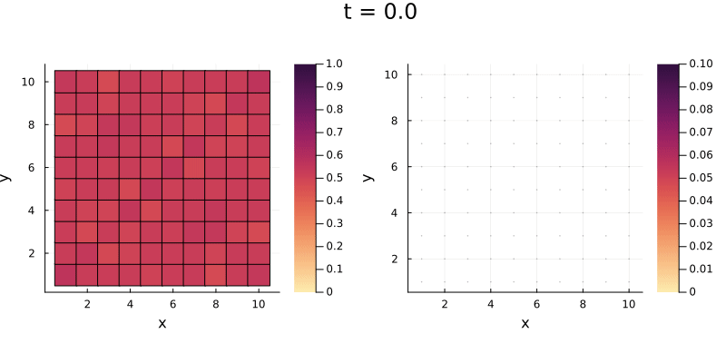

<p align="center"></p>

# LatticeModels.jl
[](https://aryavorskiy.github.io/LatticeModels.jl/)
[](https://codecov.io/gh/aryavorskiy/LatticeModels.jl)

This package provides a set of tools to simulate different quantum lattice systems.

## Installation

```jldoctest
julia> # type ] in REPL to enter pkg mode; then type the following command
pkg> add https://github.com/aryavorskiy/LatticeModels.jl
```
or
```julia
import Pkg; Pkg.add(url="https://github.com/aryavorskiy/LatticeModels.jl")
```

## Sample workflow

```julia
using LatticeModels
using Plots

# First create a lattice
l = SquareLattice(10, 10)

# Define a tight-binding model hamiltonian with a flux field through point (0, 0)
h(B) = TightBinding(l, field=FluxField(B))

# Calculate eigenvalues and eigenvectors
sp = spectrum(h(0))

# Find density matrix for filled bands (e. g. with energy < 0)
P_0 = filled_projector(sp)

# Perform unitary evolution
τ = 10
a = Animation()
@evolution {
    H := h(0.1 * min(t, τ) / τ)
    P_0 --> H --> P
} for t in 0:0.1:2τ
    # Find the local density and plot it
    plot(site_density(P), clims=(0,1))

    # Show currents on the plot
    plot!(DensityCurrents(H, P), arrows_scale=7)

    # Some more tweaks to the plot...
    title!("t = $t")
    frame(a)
end

gif(a, "animation.gif")
```

This code creates an animation which displays local density and currents on a heatmap:

