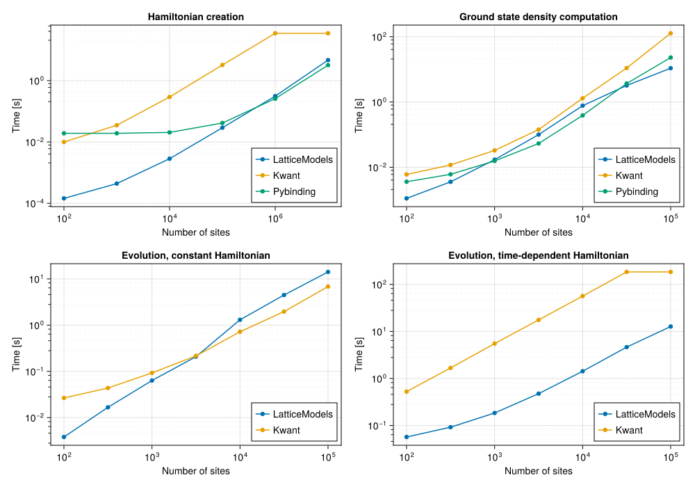

# LatticeModels.jl

This package provides a set of tools to simulate different quantum lattice systems.

## Installation

Paste the following line into the Julia REPL:
```
]add LatticeModels
```
or
```julia
import Pkg; Pkg.add("LatticeModels")
```

!!! compat
    This package has tested compatibility with Julia v1.6. However, it is recommended to use v1.8 or later for better performance and less TTFX.

## Package features
- Bravais lattices with arbitrary geometry or boundary conditions.
- Powerful operator generation tools.
- Backend-independent computations: linear operators can be of any array type, allowing to use sparse or GPU arrays when needed.
- Manybody computations.
- Smart unitary evolution reducing excessive computations where possible.
- Supports visualization with [Plots.jl](https://github.com/JuliaPlots/Plots.jl).
- Compatible with [QuantumOptics.jl](https://github.com/qojulia/QuantumOptics.jl).

## Usage example

This simple code plots local density for lowest energy states of a square tight-binding lattice.

```@example
using LatticeModels, Plots

l = SquareLattice(40, 40)
H = tightbinding_hamiltonian(l)
diag = diagonalize(H)

n = 5
clims = (0, 0.0045)
p = plot(layout = @layout[ grid(n, n) a{0.1w}], size=(1000, 850))
for i in 1:n^2
    # Plot local density on each subplot
    E_rounded = round(diag.values[i], sigdigits=4)
    plot!(p[i], localdensity(diag[i]), title="\$E_{$i} = $E_rounded\$", st=:shape, 
        clims=clims, c=:inferno, cbar=:none, lw=0, framestyle=:none, xlab="", ylab="")
end

# The following lines are kinda hacky; they draw one colorbar for all heatmaps
plot!(p[n^2+1], framestyle=:none)
scatter!([NaN], zcolor=[NaN], clims=clims, leg=:none, cbar=:right, subplot=n^2+2, 
    framestyle=:none, inset=bbox(0.0, 0.05, 0.95, 0.9), background_subplot=:transparent)
savefig("example.png")
nothing # hide
```


See more examples in the [Examples](@ref) section.

## Similar packages

Packages such as [Quantica.jl](https://github.com/pablosanjose/Quantica.jl), [pybinding](https://docs.pybinding.site/en/stable/index.html) and [Kwant](https://kwant-project.org/) provide similar functionality. And while they are all great packages, pybinding and Quantica are mostly focused on static properties of lattices. Kwant is more versatile, but its main focus is on quantum transport problems — it provides dynamic simulations in the `Tkwant` package, but `LatticeModels.jl` allows usage of various powerful backends, which improves performance and flexibility.

Here are some benchmarks: 



```@raw html
<details><summary>Benchmarks were run using this machine and Julia version.</summary>
```

```
Julia Version 1.11.3
Commit d63adeda50d (2025-01-21 19:42 UTC)
Build Info:
  Official https://julialang.org/ release
Platform Info:
  OS: Linux (x86_64-linux-gnu)
  CPU: 64 × Intel(R) Xeon(R) Platinum 8259CL CPU @ 2.50GHz
  WORD_SIZE: 64
  LLVM: libLLVM-16.0.6 (ORCJIT, skylake-avx512)
Threads: 2 default, 0 interactive, 1 GC (on 64 virtual cores)
```

```@raw html
</details>
```

One can see dramatic performance improvements on small lattice sizes, while being competitive on larger ones.
You can find the benchmarking code in [the `benchmarks` folder of the package repository](https://github.com/aryavorskiy/LatticeModels.jl/tree/master/benchmarks).

There are other nice features that `LatticeModels.jl` provides:

- **Convenient tools for setting periodic boundary conditions and gauge fields**. The only way to do this in 
    Kwant or Pybinding is to manually set the hopping values.
- **A flexible interface for defining new types of lattices and bonds**. Random lattices can be implemented
    on top of [`GenericLattice`](@ref) with ease.
- **Full-fledged quantum mechanics**. Any quantum operator can be defined and used in the simulations without much struggle.
- **Manybody computations**. `LatticeModels.jl` can handle manybody systems with particle interaction.
